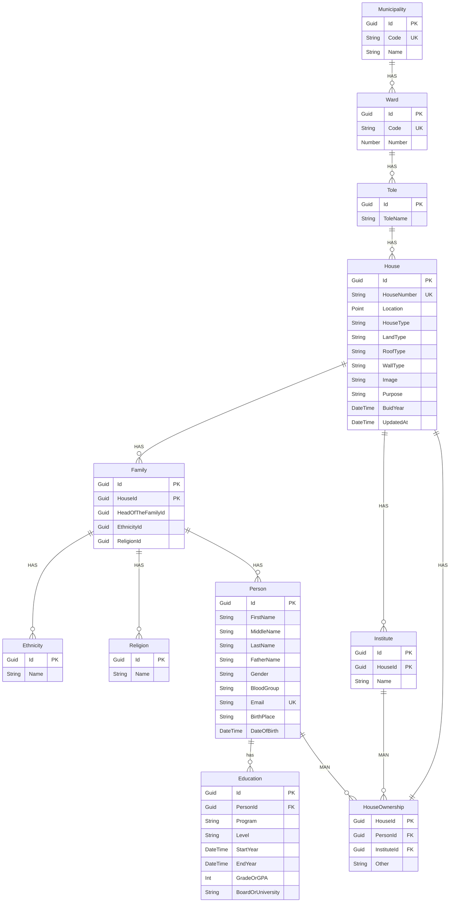

```mermaid
erDiagram
    Municipality {
        Guid Id PK
        String Code UK
        String Name
    }

    Ward {
        Guid Id PK
        String Code UK
        Number Number
    }

    Tole {
        Guid Id PK
        String ToleName
    }


    House {
        Guid Id PK
        String HouseNumber UK
        Point Location
        String HouseType
        String LandType
        String RoofType
        String WallType
        String Image
        String Purpose
        DateTime BuidYear
        DateTime UpdatedAt
    }


    Family {
        Guid Id PK
        Guid HouseId PK
        Guid HeadOfTheFamilyId
        Guid EthnicityId
        Guid ReligionId
    }

    Institute {
        Guid Id PK
        Guid HouseId PK
        String Name
    }


    Ethnicity {
        Guid Id PK
        String Name
    }

    Religion {
        Guid Id PK
        String Name
    }
    
    Person {
        Guid Id PK
        String FirstName
        String MiddleName
        String LastName
        String FatherName
        String Gender
        String BloodGroup
        String Email UK
        String BirthPlace
        DateTime DateOfBirth
    }

    HouseOwnership {
        Guid HouseId PK
        Guid PersonId FK
        Guid InstituteId FK
        String Other
    }


    Education {
        Guid Id PK
        Guid PersonId FK
        String Program
        String Level
        DateTime StartYear
        DateTime EndYear
        Int GradeOrGPA
        String BoardOrUniversity
    }


    Municipality ||--o{ Ward : HAS
    Ward ||--o{ Tole : HAS
    Tole ||--o{ House : HAS
    Family ||--o{ Ethnicity : HAS
    Family ||--o{ Religion : HAS
    Family ||--o{ Person : HAS
    Person ||--o{ Education : has
    House ||--o{ Family : HAS
    House ||--o{ Institute: HAS
    House ||--|| HouseOwnership : HAS
    Person ||--o{ HouseOwnership : MAN
    Institute ||--o{ HouseOwnership : MAN
```